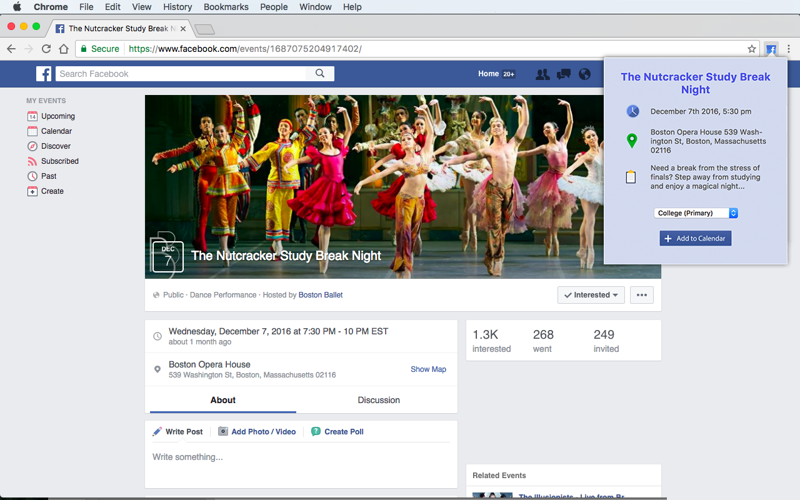

#   FB Calendar  

## Introduction

FB Calendar is a Google Chrome Extension that activates on Facebook event pages and displays the corresponding event's information (title, start/end time in your time zone, location, and description), which can be sent to your calendar with the click of a button: 

 &nbsp; &nbsp;&nbsp;&nbsp; 

## Code
As with all Chrome extensions, FB Calendar is built with standard HTML, CSS, and JavaScript. It also makes use of the [Google Calendar API](https://developers.google.com/google-apps/calendar/), [Moment.js](momentjs.com/) and [Moment Timezone](momentjs.com/timezone/), [EmailJS](emailjs.com), and jQuery 3.1.1. The majority of the work is done by [extension.js](/FB-Calendar/extension.js), which reads the event page's DOM for pertinent information, and [popup.js](/FB-Calendar/popup.js), which then receives the information, displays it, and sends it to the Google API.

## Motivation
Currently, the only way to link your Facebook events to Google Calendar is by syncing your entire Facebook calendar, which results in every event you've been invited to as well as events you've marked as "Going" to showing up in your calendar with no possibility of deletion or editing. FB Calendar allows you to discretely pick and choose which events to add as well as retain full editing control afterwards. Though other extensions exist in the Web Store with similar descriptions, all are outdated and no longer functional.

## Installation

FB Calendar is available for free on the Chrome Web Store [here](https://chrome.google.com/webstore/detail/ddnpcknbcdbgogfikadfcioemdbfokla/).

## Contributors
It seems like nearly every Facebook event's HTML is structured differently, often in ways that require extreme workarounds. If anyone finds another missing bug/loophole they'd like to tackle, please feel free to contribute to this project! 

